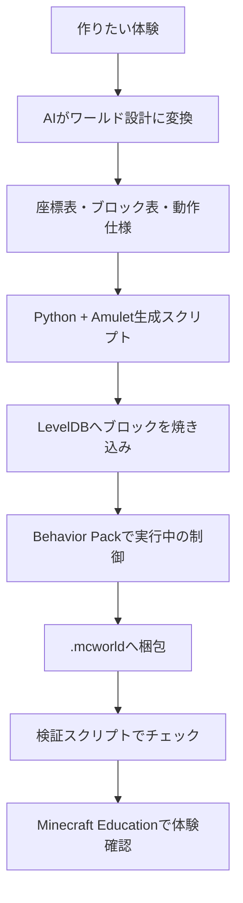

# AIでMinecraft Educationのワールドを作る考え方

このメモは、Minecraft Education のワールド制作で得た知見をもとに、**Minecraft Education のワールドは何で構成されているのか**、**AI でワールドを作るならどんな方法がよさそうか**、そして **なにもないディレクトリから、どんな順番で組み立てればよいか** を整理したものです。

ビルドコンテスト、授業、探索、脱出ゲーム、展示、クイズラリーなど、いろいろな用途に応用できることを目指しています。

> この文書は個人の検証にもとづく非公式メモです。
> Minecraft Education、Minecraft、Microsoft、Mojang の公式ドキュメントではありません。
> 実際の挙動は Minecraft Education のバージョンや環境によって変わる可能性があります。

> 前提: ここでは「すでにあるワールドを改造する」のではなく、**空のディレクトリから作り始める**ことを前提にしています。

## まず結論 🌟

AI で Minecraft Education のワールドを作るなら、現時点で試した範囲では次の形が比較的安定しやすいです。

> **AI は設計と生成コード作成を担当し、実際の `.mcworld` 生成は Python + Amulet で行う。**

つまり、AI に `.mcworld` の中身を直接作らせるのではなく、AI に次のようなものを作らせます。

- 作りたい体験の設計案
- 座標表・領域表
- ブロック配置ルール
- 保護や進行などの仕様
- Python / Amulet の生成スクリプト
- Behavior Pack の `.mcfunction`
- 検証スクリプト

そして、最後は決まったスクリプトで `.mcworld` を再生成します。この「設計とコードを分ける」考え方は、どんな種類のワールドでも共通です。



## このリポジトリの実装との関係

この文書では、初めて取り組む場合の安全策として、Minecraft Education から空のワールドをエクスポートしてテンプレートにする方法を紹介しています。

一方、このサンプル実装では `build/lib/worldgen.py` で Amulet から空の Bedrock ワールドを作る構成も試しています。これは再生成の自動化には便利ですが、Education 版特有の設定や互換性で詰まりやすいことがあります。

最初に試す場合は、次の順番がおすすめです。

1. Minecraft Education で空のワールドを作る
2. `.mcworld` としてエクスポートする
3. テンプレートとして Python から複製する
4. 慣れてきたら、空ワールド生成まで自動化する

## どんなワールドに使えるか 🎯

この作り方は、ラーメン屋ワールド専用ではありません。**仕掛け（保護・テレポート・タイマー・NPC・スコアボードなど）の組み合わせ方**を変えるだけで、いろいろな体験を作れます。

| ワールド種別 | 体験の中心 | よく使う仕掛け |
| --- | --- | --- |
| ビルドコンテスト | 区画ごとに自由建築 | 保護、チーム色の区画、タイマー、運営操作 |
| 授業・レッスン | 課題に沿って学ぶ | NPC 会話、看板、チェックポイント、テレポート |
| 探索アドベンチャー | 歩いて謎を解く | トリガー、スコアボード、テレポート、ゲート |
| 脱出ゲーム | 仕掛けを順番に解除 | レバー / ボタン、ドア制御、条件分岐、ヒント表示 |
| 展示・ミュージアム | 見て回る | 保護、案内表示、NPC、導線設計 |
| クイズラリー | 設問を巡って回答 | スコアボード、タイトル表示、正誤判定 |
| サンドボックスイベント | 自由に活動する | 保護、スポーン整備、ルール表示、リセット |

ポイントは、**どの種別でも土台（テンプレート → 設計 → 生成 → 仕掛け → 検証）は同じ**だということです。違うのは、上に乗せる仕掛けの組み合わせだけです。

## `.mcworld` の正体 📦

`.mcworld` は特別な魔法のファイルに見えますが、実体はほぼ **zip ファイル** です。

中には、Minecraft Bedrock / Education 版のワールドフォルダ一式が入っています。

```text
SomeWorld.mcworld
├── level.dat
├── level.dat_old
├── levelname.txt
├── db/
├── behavior_packs/
├── resource_packs/
├── world_behavior_packs.json
├── world_resource_packs.json
└── world_icon.jpeg など
```

AI で生成するときは、主に次の要素を作成・変更します。

| 要素 | 役割 | AI 生成での扱い |
| --- | --- | --- |
| `level.dat` | ワールド設定。名前、ゲームモード、権限、スポーン位置など | Python で直接書き換える |
| `level.dat_old` | `level.dat` のバックアップ的なもの | 存在する場合は同じように書き換える |
| `levelname.txt` | ワールド一覧に出る名前 | 表示名に合わせて書き換える |
| `db/` | ブロック、地形、チャンク、エンティティなどの本体 | Amulet で直接ブロックを焼き込む |
| `behavior_packs/` | コマンド関数やゲーム内ロジック | 仕掛け（保護・進行・演出）用に生成する |
| `resource_packs/` | テクスチャ、音、UI など見た目側 | 見た目を変えたいときだけ用意する |
| `world_behavior_packs.json` | ワールドで有効化する Behavior Pack 一覧 | 生成した BP を登録する |
| `world_resource_packs.json` | ワールドで有効化する Resource Pack 一覧 | 必要なければ空配列にする |

## ワールドを構成するもの 🧱

Minecraft Education のワールドは、ざっくり分けると次のレイヤーでできています。

| レイヤー | 何を決めるか | 例 |
| --- | --- | --- |
| ワールド設定 | 基本ルール | ゲームモード、コマンド有効、Education 機能有効 |
| 地形・ブロック | 実際の見た目と構造 | 地面、建物、区画、壁、照明、装飾 |
| 保護 | どこを編集できるか | `allow`、`deny`、`immutableWorld`、`worldbuilder` |
| 動作ロジック | 開いたあとに動く仕組み | テレポート、タイマー、ドア、メッセージ、復元 |
| パック | 追加機能や見た目 | Behavior Pack、Resource Pack |
| 検証 | 生成結果の確認 | 構造、権限、保護範囲、BP 登録 |

AI でワールドを作るときは、このレイヤーごとに設計すると破綻しにくくなります。

## LevelDB とは 🗄️

Minecraft Bedrock / Education 版では、ワールドの本体は `db/` フォルダに保存されています。

この `db/` は **LevelDB** という key-value データベースです。

Java 版のように region ファイルが中心ではなく、Bedrock / Education 版ではチャンクやサブチャンクなどが LevelDB に保存されます。

| 入っているもの | 説明 |
| --- | --- |
| チャンク | ワールドを 16x16 単位で分けた領域 |
| サブチャンク | 高さ方向も含めた 16x16x16 の小領域 |
| ブロック | 石、土、コンクリート、空気など |
| Block Entity | コマンドブロック、看板、チェストなど追加データを持つブロック |
| Entity | Mob、アイテム、その他の動くもの |
| scoreboard | スコアボード状態 |
| player data | 保存済みプレイヤー情報 |

## Amulet とは 🛠️

Amulet は、Minecraft のワールドデータを Python から読み書きするためのライブラリです。

Amulet を使うと、ゲームを起動しなくても Python から `db/` の中のブロックを直接変更できます。

たとえば、生成スクリプトでは次のような考え方でブロックを置きます。

```python
level.set_version_block(x, y, z, dimension, version, block)
```

これにより、ゲームを起動して手でブロックを置かなくても、Python から指定座標にブロックを配置できます。

Amulet が裏側でやってくれることは、おおまかに次の通りです。

```text
座標 x,y,z を受け取る
  ↓
対応するチャンク・サブチャンクを探す
  ↓
ブロックパレットやブロックデータを更新する
  ↓
LevelDB へ書き戻す
```

Amulet でよく焼き込むものの例です。

- 床や地面（色付きコンクリート、芝生など）
- 壁・柱・装飾などの構造物
- `allow` / `deny` などの保護ブロック
- レバー・ボタン・感圧板などの入力装置
- コマンドブロック（仕掛けの起動用）
- 看板やマーカー（案内・目印）
- 照明（シーランタン、グロウストーンなど）

## tick とは ⏱️

Minecraft の **tick** は、ゲーム内の更新単位です。

通常、Minecraft は 1 秒に 20 tick 動きます。

Behavior Pack では、`tick.json` に指定した関数を毎 tick 実行できます。

Behavior Pack の中に `tick.mcfunction` を作ると、ワールドを開いたあと毎 tick 処理を走らせられます。

重要なのは、**生成時の処理** と **実行中の処理** を分けることです。

| タイミング | 使うもの | 役割 |
| --- | --- | --- |
| 生成時 | Python + Amulet | ブロックや初期状態を LevelDB へ焼き込む |
| 実行中 | Behavior Pack + tick | 保護、復元、タイマー、ドアなどを動かす |

## なにもないディレクトリから作る手順 🧭

空のディレクトリから始める場合、いちばん大事なのは **最初の「種ワールド（テンプレート）」をどう手に入れるか** です。ここさえ通れば、あとはスクリプトで何度でも再生成できます。

### 全体の流れ

```text
0. 道具をそろえる（Python + Amulet + Minecraft Education）
1. 種ワールド（最小テンプレート）を1つ手に入れる ← 唯一の手作業
2. ディレクトリ構成を決める
3. 設計ファイルを書く（どんな体験にするか）
4. 生成器を書く（テンプレ→ブロック→level.dat→BP→梱包）
5. 仕掛け（Behavior Pack）を足す
6. .mcworldへ梱包する
7. 検証して、Minecraft Educationで開いて確認する
```

### Step 0: 道具をそろえる

- Python 3.12
- Amulet（`amulet-core`、`amulet-leveldb`）
- Minecraft Education 本体（種ワールドの作成と動作確認に使う）

```powershell
py -3.12 -m pip install amulet-core amulet-leveldb
```

### Step 1: 種ワールドを手に入れる

なにもないディレクトリには、Minecraft がワールドとして認識する最低限の構造（`level.dat` や `db/`）がありません。これをゼロから Python だけで正しく作るのは、Education 特有のフラグ整合が崩れやすく難易度が高いです。

そこで、**最初の 1 個だけは Minecraft Education からエクスポートして用意する**のがいちばん安全です。

手順:

1. Minecraft Education を起動する
2. 新規ワールドを作る（おすすめ: フラット地形 / クリエイティブ / コマンド ON）
3. 余計なものを置かず、ほぼ空のまま保存する
4. そのワールドを `.mcworld` としてエクスポートする
5. エクスポートした `.mcworld` を zip として展開し、中身を `build/template/` へ置く

これで「再生成のたびにコピーして使う種」が手に入ります。**この手作業は最初の一度だけ**で、以降はスクリプトがこのテンプレートを複製して使います。

> メモ: Amulet で新規ワールドを生成する方法もありますが、最初はエクスポート方式のほうが確実です。テンプレートが用意できたら、あとの工程は自動化できます。

## おすすめディレクトリ構成 📁

なにもないディレクトリから始めるなら、**設計（design）・生成器（build）・出力（dist）を分ける**構成がおすすめです。

```text
my-world/
├── design/
│   └── world.json            # どんな体験にするかの設計データ
├── build/
│   ├── template/             # Step 1で手に入れた種ワールド
│   ├── new_world.py          # 生成器（設計→.mcworld）
│   ├── validate_world.py     # 検証スクリプト
│   └── lib/                  # 仕掛けの部品（再利用する関数群）
│       ├── geom.py           # ブロック配置のヘルパー
│       ├── protection.py     # allow / deny / 保護
│       ├── behavior_pack.py  # BP生成（tick / 関数）
│       └── packer.py         # .mcworld 梱包
├── dist/
│   └── MyWorld.mcworld       # 出力
└── docs/
    └── design-notes.md       # 設計メモ
```

この形にしておくと、**変えたい設計は `design/`、仕掛けの追加は `build/lib/`** のように分けられ、AI にも頼みやすくなります。

## 設計と生成を分ける 🧩

AI 生成を仕組みにするなら、最初から「設計データ」と「生成器」を分けるのがよいです。

### `design/world.json`

AI や人間が編集する設計データです。用途に合わせて中身を変えます。

```json
{
  "worldName": "サンプルワールド",
  "displayName": "01 サンプルワールド",
  "spawn": { "x": 0, "y": 4, "z": 0 },
  "regions": [
    { "id": "A", "x1": -16, "x2": -1, "z1": 0, "z2": 15, "tag": "team-red" },
    { "id": "B", "x1": 1, "x2": 16, "z1": 0, "z2": 15, "tag": "team-blue" }
  ],
  "mechanics": [
    { "type": "protection", "scope": "regions", "buildableInside": true },
    { "type": "spawnGuide", "teleportTo": { "x": 0, "y": 4, "z": -4 } },
    { "type": "signs", "messages": ["ようこそ", "ここから始めます"] }
  ],
  "rules": {
    "gameMode": "creative",
    "immutableWorld": true,
    "mobSpawning": false
  }
}
```

ポイントは、`regions`（領域）と `mechanics`（仕掛け）を**データとして分けて持つ**ことです。ビルドコンテストなら `regions` はチーム区画、クイズラリーなら設問スポット、というように、同じ生成器のまま用途を変えられます。

### `build/new_world.py`

設計データを読んで、実際に `.mcworld` を作る生成器です。

担当すること:

- `build/template/` をコピーして作業ディレクトリを作る
- `level.dat` を設計に合わせて書き換える
- Amulet で `db/` へブロック（地形・領域・仕掛け）を配置する
- 必要な Behavior Pack を生成する
- `world_behavior_packs.json` へ登録する
- `dist/` へ `.mcworld` として梱包する

### `build/validate_world.py`

生成結果を確認する検証スクリプトです。

確認したいこと（用途に応じて選ぶ）:

- 必要な数の領域があるか
- 保護が意図どおりか（`allow` が内側、`deny` が外側など）
- スポーン位置が正しいか
- `level.dat` の設定が正しいか
- Behavior Pack が有効化されているか
- 仕掛けに必要な関数（`tick` など）が存在するか

## AI に任せるとよいこと 🤖

AI が得意なのは、要件を構造化し、再利用できる設計やコードに落とすことです。

| AI に任せやすいこと | 例 |
| --- | --- |
| 要件整理 | 何人用か、どんな体験か、制限時間はあるかを整理する |
| 空間設計 | 入口、メイン領域、通路、観覧・休憩エリアの配置を考える |
| 座標表作成 | 各領域の `x1/x2/z1/z2` を表にする |
| ブロックパレット設計 | 床材、壁材、装飾、照明、色を選ぶ |
| 生成コード作成 | 領域描画や `fill` 処理を書く |
| Behavior Pack 作成 | タイマー、ドア、タイトル表示などの仕掛けを書く |
| 検証コード作成 | 生成後の構造や設定をチェックする |
| ドキュメント作成 | 再生成手順や運用手順を書く |

## AI だけに任せすぎないほうがよいこと ⚠️

AI の出力をそのまま信じるのではなく、固定ルールと検証で守るべきところがあります。

| 注意するところ | 理由 |
| --- | --- |
| LevelDB の直接編集 | 形式が複雑で壊れやすい。Amulet 経由がよい |
| 権限・保護 | Education 版では挙動確認が重要 |
| Behavior Pack の UUID | キャッシュや同名パック問題が起きやすい |
| `allow` / `deny` の範囲 | 1 ブロックずれるだけで編集可否が変わる |
| tick 処理 | 毎 tick 動くため、重い処理や誤処理に注意が必要 |
| 実際のプレイ感 | 導線、見やすさ、操作感は実機確認が必要 |

## 最初の MVP 🚀

なにもないディレクトリから始めるなら、最初のゴールはこれがよさそうです。

> **種ワールドから、保護付きの平面ワールドを 1 つ、JSON 設計ファイル + Python 生成器 + 検証スクリプトで作る。**

最初の MVP は、次のくらいで十分です。

| 機能 | 内容 |
| --- | --- |
| 平面ワールド | 種テンプレートを複製し、床と周囲を整える |
| 領域 | A / B など少数の領域を色付きで置く |
| 保護 | `allow` / `deny` / `immutableWorld` を設定する |
| 初期スポーン | 入口前にスポーンさせる |
| 看板 | 「ようこそ」など案内を 1 枚置く |
| 検証 | 領域数、保護、スポーンをチェックする |

ここまで通ると、「設計を変えれば別のワールドが出る」状態の最小形ができあがります。

## 覚えておくとよい整理 📝

最後に、用語を短くまとめます。

| 用語 | ひとことで言うと |
| --- | --- |
| `.mcworld` | zip された Minecraft Education ワールド一式 |
| `level.dat` | ワールド設定ファイル |
| `db/` | ブロックや地形が入った LevelDB データベース |
| LevelDB | Bedrock / Education 版ワールド本体の保存形式 |
| Amulet | LevelDB を Python から扱いやすくするライブラリ |
| Behavior Pack | ワールドに動作ロジックを追加するパック |
| Resource Pack | 見た目や音を変えるパック |
| tick | Minecraft の更新単位。通常 1 秒 20 回 |
| `.mcfunction` | Minecraft コマンドを並べた関数ファイル |
| `allow` | Education 版で、その上の編集を許可するブロック |
| `deny` | Education 版で、その上の編集を拒否するブロック |
| `worldbuilder` | 保護を無視して編集できる能力 |
| 種ワールド | 再生成の元にする最小テンプレート |

AI で作るワールド制作は、AI に完成品を直接吐かせるより、**設計を構造化して、再生成できるスクリプトに落とす** のが強いです。

この方式なら、なにもないディレクトリからでも始められます。失敗しても直せます。用途を変えたくなったら、設計と仕掛けを差し替えるだけで、同じ土台から別のワールドを作り直せます。
